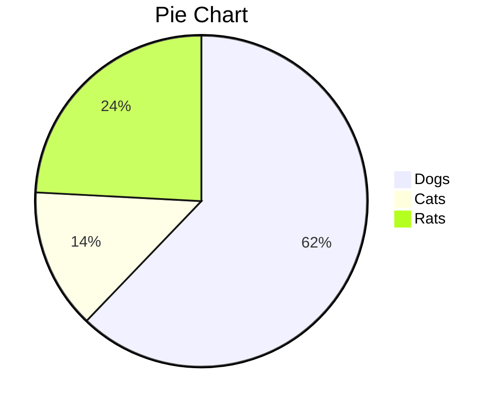

# 一级标题

[TOC]

## 二级标题

### 三级标题

#### 四级标题

##### 五级标题

###### 六级标题

标题样式来自[zj主题][1]^[1]^（这是一个参考链接，按住<kbd>ctrl</kbd>键并点击将自动打开浏览器并跳转至相关链接，其中上标`[1]`只是一个额外的标注）

注：部分样式需要在偏好设置中开启，如上下标、行内公式、图表等

行内公式：$\lim\limits_{x \to \infty} \exp(-x)=0$，行间公式：
$$
E_0 = mc^2 \\
\quad\text{—— Albert Einstein}
$$

推荐：[latex手写公式识别](http://draw.mathpix.com/)、[latex公式编辑器](https://www.latexlive.com/)

可以直接用尖括号包裹URL链接或邮箱：<https://emojixd.com/>

> 提示块标签
>
> > 嵌套提示块

- 无序列表1

- 无序列表2

1. 有序列表1[^1]
2. 有序列表2

==文本高亮==，__加粗__，*斜体*，==***斜体高亮加粗***==，~~删除线~~，<u>下划线</u>。`<font>`标签被我用于一款小标签样式（小康）：<font>红色小标签</font>，可以通过设置`background-color`属性控制背景色，如：<font style="background-color:#8bc34a">绿色小标签</font>，为了方便，我提供了五种预定义的颜色（包括前面的红色、绿色）：<font title="blue">蓝色小标签</font>、<font title="yellow">黄色小标签</font>、<font title="gray">灰色小标签</font>。一些强调型格式：<span alt="underline">下划线</span>、<span alt="emp">着重号</span>、<span alt="wavy">波浪线</span>。<span alt="hide">隐藏文本</span>

<span alt="rainbow">彩虹变换字体特效</span>（嫖自[黑石大佬](https://www.heson10.com/posts/21347.html)🙇‍♀️），<span alt="modern">欢迎光临</span>（嫖自[QinXS](https://7bxing.com/friends/)🙇‍♀️），<span alt="shake">抖音字效</span>（嫖自[NyKee](https://www.nykee.cn/)🙇‍♀️）

```python
def decorator(func):
    def wrapper(*args, **kwargs):
        ...
        return func(*args, **kwargs)
    return wrapper
```

```diff
+ 新增行
- 删除行
其他行
```

| 表头1    |   表头2   |     表头3 |
| :------- | :-------: | --------: |
| muggledy | celestezj | 2021.9.25 |
|          |           |           |
|          |           |           |
|          |           |           |

[跳转](#二级标题)至指定标题（锚点），也可以在任意位置通过`<a name="锚点名" alt="none"> </a>`（为了方便编辑，typora会显示空标签或`style="display:none"`的标签，但填充一个空格就可以被隐藏，在导出为HTML文件时，由于该款超链接样式有一个padding宽度，所以空链接还是会显示下划线，`alt="none"`用于避免该问题，如果自定义的锚点有文字说明，则不要使用`alt="none"`）设定锚点，示例：[求点个赞呗](#star)

上下标：X^2^, H~2~o，下标如果是多个单词或字符并以空格分隔，需要对空格进行转义，即在空格前面加`\`，譬如`X~下标1\ 下标2~`（X~下标1\ 下标2~）。要显示\*特殊字符等，也是通过反斜杠转义

<ruby>Base<rp> (</rp><rt>top</rt><rp>) </rp></ruby>、<ruby>佐天泪子<rp> (</rp><rt>xiān qún kuáng mó</rt><rp>) </rp></ruby>、<ruby>超電磁砲<rp> (</rp><rt>レールガン</rt><rp>) </rp></ruby>


注：按``（或``）插入图片时会显示阴影，否则没有，类似的，设为`alt="blur-随便写"`时会有模糊效果。右键图片可以进行指定比例的缩放，任意比例可以通过`style="zoom:0.x"`属性实现

<audio controls="controls">
  <source src="./temp/The Sound Of Silence.mp3" type="audio/mp3" />
</audio>

> 可以将`<audio>`音频包裹在`<center></center>`中居中显示

插入网易云的外链播放器（`<iframe>`，可嵌入油管等平台视频）：

<iframe frameborder="no" border="0" marginwidth="0" marginheight="0" src="//music.163.com/outchain/player?type=2&id=1342183925&auto=0"></iframe>

<video src="./temp/难破船.mp4"></video>

<details>
    <summary>折叠标签</summary>
    青青子衿，悠悠我心
</details>

> 关于Typora对HTML的支持说明：<https://support.typora.io/HTML/>

[Emoji表情符号](https://www.webfx.com/tools/emoji-cheat-sheet/)：:smile:（`:smile:`），Decimal NCRs或Hexadecimal NCRs^[2]^编码也是受支持的，譬如“笑哭”：&#128514;（`&#128514;`）或&#x1F602;（`&#x1F602;`）



> 更多绘图参考[官方文档][]（这是另一种参考链接写法）

任务列表：

- [ ] 未完成任务1
- [ ] 未完成任务2
- [x] 已完成任务1
- [x] 已完成任务2

> 本主题（typora-dyzj-theme）的很多样式来自Hexo的<span alt="btn"><a href="https://butterfly.js.org">butterfly</a></span>主题，再次表达感谢🙇‍♀️

---

<a name="star" alt="none"> </a>都看到这里了，如果您喜欢的话，点个赞:+1:再走吧：

<iframe style="margin-left: 2px; margin-bottom:-5px;" frameborder="0" scrolling="0" width="100px" height="20px" src="https://ghbtns.com/github-btn.html?user=muggledy&repo=typora-dyzj-theme&type=star&count=true" > </iframe>

[^1]: 该样式来自[Butterfly主题](https://butterfly.js.org)（这是一个脚注）

[1]: https://github.com/Theigrams/My-Typora-Themes	"本样式修改自zj主题（这是一个链接引用）"
[2]:https://www.ifreesite.com/unicode/
[官方文档]: https://support.typora.io/Draw-Diagrams-With-Markdown/