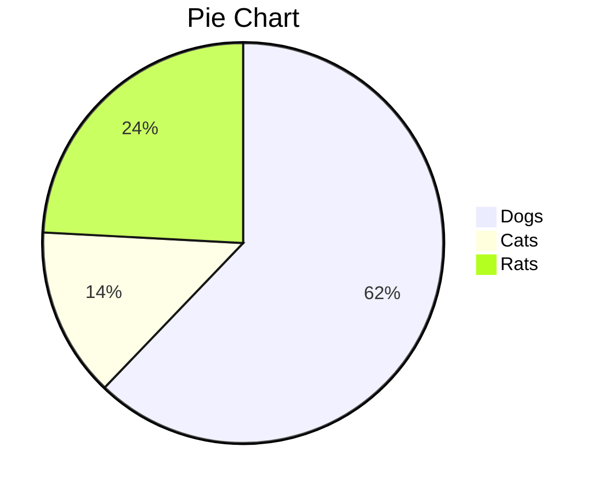

# 一级标题

[TOC]

## 二级标题

### 三级标题

#### 四级标题

##### 五级标题

###### 六级标题

标题样式来自[zj主题][1]^[1]^（这是一个参考链接，按住<kbd>ctrl</kbd>键并点击将自动打开浏览器并跳转至相关链接，其中上标`[1]`只是一个额外的标注）

注：部分样式需要在偏好设置中开启，如上下标、行内公式、图表等。Markdown写法参考说明文档<sup><a href="https://support.typora.io/Markdown-Reference" alt="ref">🚀</a></sup>，试用其他如印象等在线Markdown编辑器<span alt="ref">[[Ref 1](https://www.zybuluo.com/mdeditor),[Ref 2](https://maxiang.io/),[Ref 3](https://editoe.com/),[Ref 4](https://b3log.org/vditor)]</span>

行内公式：$\lim\limits_{x \to \infty} \exp(-x)=0$，行间公式：
$$
E_0 = mc^2 \\
\quad\text{—— Albert Einstein}
$$

推荐：[latex手写公式识别](http://draw.mathpix.com/)、[latex公式编辑器](https://www.latexlive.com/)

可以直接用尖括号包裹URL链接或邮箱：<https://emojixd.com/>

> 提示块标签
>
> > 嵌套提示块

其他型号提示块：

<blockquote alt="success"><p>成功型提示块</p></blockquote>

<blockquote alt="question"><p>问题型提示块</p></blockquote>

<blockquote alt="warn"><p>警告型提示块</p></blockquote>

<blockquote alt="danger"><p>危险型提示块</p></blockquote>

- 无序列表1

- 无序列表2

1. 有序列表1[^1]
2. 有序列表2

==文本高亮==，__加粗__，*斜体*，==***斜体高亮加粗***==，~~删除线~~，<u>下划线</u>。`<font>`标签被我用于一款小标签样式（[小康](https://www.antmoe.com/posts/3b43914f/)）：<font>红色小标签</font>，可以通过设置`background-color`属性控制背景色，如：<font style="background-color:#8bc34a">绿色小标签</font>，为了方便，我提供了五种预定义的颜色（包括前面的红色、<span alt="glow">绿色</span>）：<font title="blue">蓝色小标签</font>、<font title="yellow">黄色小标签</font>、<font title="gray">灰色小标签</font>。一些强调型格式：<span alt="underline">下划线</span>、<span alt="emp">着重号</span>、<span alt="wavy">波浪线</span>。其他：<span alt="hide">隐藏文本</span>，<span alt="hollow">空心字</span>，<span alt="blink">字体闪烁</span>

<span alt="rainbow">彩虹变换字体特效</span>（嫖自[黑石大佬](https://www.heson10.com/posts/21347.html)🙇‍♀️），<span alt="modern">欢迎光临</span>（嫖自[QinXS](https://7bxing.com/friends/)🙇‍♀️），<span alt="shake">抖音字效</span>（嫖自[NyKee](https://www.nykee.cn/)🙇‍♀️）

```python
def decorator(func):
    def wrapper(*args, **kwargs):
        ...
        return func(*args, **kwargs)
    return wrapper
```

```diff
+ 新增行
- 删除行
其他行
```

| 表头1    |   表头2   |     表头3 |
| :------- | :-------: | --------: |
| muggledy | celestezj | 2021.9.25 |
|          |           |           |
|          |           |           |
|          |           |           |

提供另一种常见表格样式：

<div alt="three-table"> <!--alt还可取值为"notitle-table"，一种无表头的小型表格-->
<table>
  <tr>
    <th alt="left">标题1</th>
    <th alt="center">标题2</th>
    <th alt="right">标题3</th>
  </tr>
  <tr>
    <td alt="left">居左：alt="left"</td>
    <td alt="center">居中：alt="center"</td>
    <td alt="right">居右：alt="right"</td>
  </tr>
  <tr>
    <td alt="left">x</td>
    <td alt="center">y</td>
    <td alt="right">z</td>
  </tr>
</table>
</div>
<div alt="fig">表1.&nbsp;&nbsp;&nbsp;&nbsp;三线表</div>

[跳转](#二级标题)至指定标题（锚点），也可以在任意位置通过`<a name="锚点名" alt="none"> </a>`（为了方便编辑，typora会显示空标签或`style="display:none"`的标签，但填充一个空格就可以被隐藏，在导出为HTML文件时，由于该款超链接样式有一个padding宽度，所以空链接还是会显示下划线，`alt="none"`用于避免该问题，如果自定义的锚点有文字说明，则不要使用`alt="none"`）设定锚点，示例：[求点个赞呗](#star)

<a href="#" alt="null">无样式链接</a>，主要用于图片超链接等，如：<a href="#" alt="null"></a>

上下标：X^2^, H~2~o，下标如果是多个单词或字符并以空格分隔，需要对空格进行转义，即在空格前面加`\`，譬如`X~下标1\ 下标2~`（X~下标1\ 下标2~）。要显示\*特殊字符等，也是通过反斜杠转义

<ruby>Base<rp> (</rp><rt>top</rt><rp>) </rp></ruby>、<ruby>佐天泪子<rp> (</rp><rt>xiān qún kuáng mó</rt><rp>) </rp></ruby>、<ruby>超電磁砲<rp> (</rp><rt>レールガン</rt><rp>) </rp></ruby>


注：按``（或``）插入图片时会显示阴影，否则没有，类似的，设为`alt="blur-随便写"`时会有模糊效果，设为`alt="gray-随便写"`时图片默认为暗灰色。右键图片可以进行指定比例的缩放，任意比例可以通过`style="zoom:0.x"`属性实现

目前会对图片自动编号，但要正确显示图释（`alt`属性值），还需额外修改<u>frame.js</u>源码（在安装路径<span alt="str">Typora/resources/app/app/window/</span>下），分别定位到`h="<span md-inline='"+v+"'"+S+" contenteditable='false' class='md-image"+L+"' data-src='"+F+"' "+b+">`以及`h="<span md-inline='"+v+"'"+S+" contenteditable='false' class='md-image md-img-loaded"+w+"' "+b+">`处（适用于Typora v0.9.98，注意版本不同，相关代码可能稍有区别），将两处末尾的`">`都替换为以下字符串即可：

```js
" alt='"+ (k.getAttribute("alt") ? ". "+(/^(shadow-|blur-|gray-)?(.*)$/.exec(k.getAttribute("alt"))[2]) : "") +"'>
```

Typora v1.4.7：

```js
s="<span md-inline='"+g+"'"+S+" contenteditable='false' class='md-image"+L+"' data-src='"+k+"' "+b+">
s="<span md-inline='"+g+"'"+S+" contenteditable='false' class='md-image md-img-loaded"+w+"' "+b+">
//替换为：
" alt='"+ (F.getAttribute("alt") ? ". "+(/^(shadow-|blur-|gray-)?(.*)$/.exec(F.getAttribute("alt"))[2]) : "") +"'>
```

或者直接在图片下方手动写图释（适用于非img标签）：`<div alt="fig">图释说明</div>`

<audio controls="controls">
  <source src="./temp/The Sound Of Silence.mp3" type="audio/mp3" />
</audio>

> 可以将`<audio>`音频包裹在`<center></center>`中居中显示

插入网易云的外链播放器（`<iframe>`，可嵌入油管等平台视频）：

<iframe frameborder="no" border="0" marginwidth="0" marginheight="0" src="//music.163.com/outchain/player?type=2&id=1342183925&auto=0"></iframe>

<video src="./temp/难破船.mp4"></video>

<details>
    <summary>折叠标签</summary>
    青青子衿，悠悠我心
</details>

> 关于Typora对HTML的支持说明：<https://support.typora.io/HTML/>

[Emoji表情符号](https://www.webfx.com/tools/emoji-cheat-sheet/)：:smile:（`:smile:`），Decimal NCRs或Hexadecimal NCRs^[2]^编码也是受支持的，譬如“&#31505;&#21741;”：&#128514;（`&#128514;`）或&#x1F602;（`&#x1F602;`）



[在线Mermaid编辑器](https://mermaid.live/edit)、[幕布脑图](https://mubu.com/home)（MD文档以OPML格式导出然后借助幕布转换为思维脑图）

> 更多绘图参考[官方文档][]（这是另一种参考链接写法）

<center><svg xmlns="http://www.w3.org/2000/svg" xmlns:xlink="http://www.w3.org/1999/xlink" version="1.1" height="400px" viewBox="-0.5 -0.5 1071 773" content="&lt;mxfile host=&quot;app.diagrams.net&quot; modified=&quot;2021-11-15T07:08:52.373Z&quot; agent=&quot;5.0 (Windows NT 10.0; WOW64) AppleWebKit/537.36 (KHTML, like Gecko) Chrome/86.0.4240.198 Safari/537.36&quot; etag=&quot;aOnjZZMrixLFimZz001-&quot; version=&quot;15.7.3&quot; type=&quot;google&quot;&gt;&lt;diagram id=&quot;07fea595-8f29-1299-0266-81d95cde20df&quot; name=&quot;Page-1&quot;&gt;7Zpdk5o8FMc/jZfrkDeEy3Xdtjed6cx25rnOIylmisbGuGI/fQMEAZN1sY2uW+qNchKS8P9xPOcERuhhmX+UdL34LBKWjWCQ5CM0G0F4F4NQfxWWvbGEpDKkkieVCTSGJ/6TGWNgrFuesE2noxIiU3zdNc7FasXmqmOjUopdt9s3kXVnXdOUWYanOc1s6388UQtjBWHcNHxiPF2YqSM4qRr+p/PvqRTblZlvJVasalnSehhzjZsFTcSuZUKPI/QghVDVr2X+wLJC1lqx6rwPL7QelizZSvU5YQJRdcozzbbmus3K1L4WYrfgij2t6bw43mnYIzT9xrPsQWRCll0QgPf3U6LtqaQJ15PXbeW1N+YZlxoVFyvdxOhGr3G6UVJ8Z0f9F2qZ6SNQzCSa0fRMEGFM9Oqn9qWaq39mUrG8ZTKX/pGJJVNyr7uYVojjydjclOYmBTjEYxI0HyPHrnUH1PAWLfgAGSM1d116mK2RX/8wBF6igYdMI7RpEIxr02sESDAO2tyQDx5kyDwih3fEvXmAwItHhAMmgAIHAdifwMQLgcnrBFiiI6c5fFWhyj8PytaxFVlat/u+qGYx9Ukt2yoFp+5TyTKq+HM3+rukM3N8EVyvpRVMkP331bhLPdBGbOWcmXPbkbnHcABYwykqU6as4UqqBxF6go68uNqHIJoE787VXKkAQm+ZCsReaDxGJMTwb6ABgy6Nvn+CXmjUgwzTNxyJGYrwGMfNJ+pJg8TjuH2ajywNAS9w3qmruOCQ3jmCH++AQ/YOR5pcRo6eHhF6IeCnjH+nLuAgAPq7AIi8EOhRuv9Lk72nyQiRPsN5TJORvSfwhUqqh2CyXNcxdX0Xlw6iPY+v0q9C+93sjtjszQ4oiOpjM0TBdV2svLwWMh2R2Uv+5sGZEAptQSPocKbIcZdAL65k1/w56C8rzXha/DHNtQgaCZoWF8/nNLs3DUueJMUolsongFwPgCv3JXF43YBu1/y5/Xf21xJwbURem4BdjOdoOAQcEf3qBPwU4O905xFaYTV2bv0i0tl1BwC7cHR35usdxT/Cg4dckZd42uX3ESrSLc7jG8I25Frd5VXAk1cd+vwZHruS/7pfM205IwFriWmHjHZQIb5ktaJFDOLOZiGwJL5Y9ortUtxIeEYGdQsSkreT0K6ljYRnpEC3IGH8dhKerlL3v6XjuVWqh0QQ2YlgEJFrVqPYrkb3t1aN+qg6A3Is9OuvwiDXRhHsbvFPvKQNdkG6v7WC9DIQ3FvJ1xPerkP3t1aHXkb48nnjGwrvKj/DTBk9OvqHP7aibrjblErdF8EyWOdlbKvb9a+0+J5xqhPkpe6iuNJjmHH1mqqhq14Xo1yhRMERdXA6aPugbG09R87HBBFwUMbEA1Uy6KrV8ToTmpzxgp8PAIOuPx0AYNj/QRnwQsAuMXN8YxHlgo9XHAguu7OpD5v3yasHXs37+ujxFw==&lt;/diagram&gt;&lt;/mxfile&gt;" onclick="(function(svg){var src=window.event.target||window.event.srcElement;while (src!=null&amp;&amp;src.nodeName.toLowerCase()!='a'){src=src.parentNode;}if(src==null){if(svg.wnd!=null&amp;&amp;!svg.wnd.closed){svg.wnd.focus();}else{var r=function(evt){if(evt.data=='ready'&amp;&amp;evt.source==svg.wnd){svg.wnd.postMessage(decodeURIComponent(svg.getAttribute('content')),'*');window.removeEventListener('message',r);}};window.addEventListener('message',r);svg.wnd=window.open('https://viewer.diagrams.net/?client=1&amp;page=0&amp;edit=_blank');}}})(this);" style="cursor:pointer;max-width:100%;max-height:773px;"><defs/><g><rect x="100.5" y="610.5" width="120" height="130" fill="#12aab5" stroke="none" pointer-events="all"/><rect x="300.5" y="690.5" width="120" height="50" fill="#12aab5" stroke="none" pointer-events="all"/><rect x="500.5" y="640.5" width="120" height="100" fill="#12aab5" stroke="none" pointer-events="all"/><rect x="700.5" y="570.5" width="120" height="170" fill="#12aab5" stroke="none" pointer-events="all"/><path d="M 40.5 740.5 L 40.5 270.6" fill="none" stroke="#000000" stroke-width="3" stroke-miterlimit="10" pointer-events="stroke"/><path d="M 40.5 263.85 L 45 272.85 L 40.5 270.6 L 36 272.85 Z" fill="#000000" stroke="#000000" stroke-width="3" stroke-miterlimit="10" pointer-events="all"/><rect x="100.5" y="480.5" width="120" height="130" fill="#f08705" stroke="none" pointer-events="all"/><rect x="100.5" y="350.5" width="120" height="130" fill="#e85642" stroke="none" pointer-events="all"/><rect x="300.5" y="530.5" width="120" height="160" fill="#f08705" stroke="none" pointer-events="all"/><rect x="300.5" y="500.5" width="120" height="30" fill="#e85642" stroke="none" pointer-events="all"/><rect x="500.5" y="480.5" width="120" height="160" fill="#f08705" stroke="none" pointer-events="all"/><rect x="500.5" y="300.5" width="120" height="180" fill="#e85642" stroke="none" pointer-events="all"/><path d="M 40.5 740.5 L 950.4 740.5" fill="none" stroke="#000000" stroke-width="3" stroke-miterlimit="10" pointer-events="stroke"/><path d="M 957.15 740.5 L 948.15 745 L 950.4 740.5 L 948.15 736 Z" fill="#000000" stroke="#000000" stroke-width="3" stroke-miterlimit="10" pointer-events="all"/><rect x="970.5" y="728.5" width="80" height="20" fill="none" stroke="none" pointer-events="all"/><g transform="translate(-0.5 -0.5)"><switch><foreignObject pointer-events="none" width="100%" height="100%" requiredFeatures="http://www.w3.org/TR/SVG11/feature#Extensibility" style="overflow: visible; text-align: left;"><div xmlns="http://www.w3.org/1999/xhtml" style="display: flex; align-items: unsafe flex-start; justify-content: unsafe flex-start; width: 1px; height: 1px; padding-top: 731px; margin-left: 973px;"><div data-drawio-colors="color: rgba(0, 0, 0, 1); " style="box-sizing: border-box; font-size: 0px; text-align: left;"><div style="display: inline-block; font-size: 18px; font-family: Helvetica; color: rgb(0, 0, 0); line-height: 1.2; pointer-events: all; white-space: nowrap;">Parameter x</div></div></div></foreignObject><text x="973" y="749" fill="rgba(0, 0, 0, 1)" font-family="Helvetica" font-size="18px">Parameter...</text></switch></g><rect x="100.5" y="742.5" width="120" height="30" fill="none" stroke="none" pointer-events="all"/><g transform="translate(-0.5 -0.5)"><switch><foreignObject pointer-events="none" width="100%" height="100%" requiredFeatures="http://www.w3.org/TR/SVG11/feature#Extensibility" style="overflow: visible; text-align: left;"><div xmlns="http://www.w3.org/1999/xhtml" style="display: flex; align-items: unsafe center; justify-content: unsafe center; width: 1px; height: 1px; padding-top: 755px; margin-left: 161px;"><div data-drawio-colors="color: rgba(0, 0, 0, 1); " style="box-sizing: border-box; font-size: 0px; text-align: center;"><div style="display: inline-block; font-size: 18px; font-family: Helvetica; color: rgb(0, 0, 0); line-height: 1.2; pointer-events: all; white-space: nowrap;">x1</div></div></div></foreignObject><text x="161" y="760" fill="rgba(0, 0, 0, 1)" font-family="Helvetica" font-size="18px" text-anchor="middle">x1</text></switch></g><rect x="300.5" y="742.5" width="120" height="30" fill="none" stroke="none" pointer-events="all"/><g transform="translate(-0.5 -0.5)"><switch><foreignObject pointer-events="none" width="100%" height="100%" requiredFeatures="http://www.w3.org/TR/SVG11/feature#Extensibility" style="overflow: visible; text-align: left;"><div xmlns="http://www.w3.org/1999/xhtml" style="display: flex; align-items: unsafe center; justify-content: unsafe center; width: 1px; height: 1px; padding-top: 755px; margin-left: 361px;"><div data-drawio-colors="color: rgba(0, 0, 0, 1); " style="box-sizing: border-box; font-size: 0px; text-align: center;"><div style="display: inline-block; font-size: 18px; font-family: Helvetica; color: rgb(0, 0, 0); line-height: 1.2; pointer-events: all; white-space: nowrap;">x2</div></div></div></foreignObject><text x="361" y="760" fill="rgba(0, 0, 0, 1)" font-family="Helvetica" font-size="18px" text-anchor="middle">x2</text></switch></g><rect x="500.5" y="742.5" width="120" height="30" fill="none" stroke="none" pointer-events="all"/><g transform="translate(-0.5 -0.5)"><switch><foreignObject pointer-events="none" width="100%" height="100%" requiredFeatures="http://www.w3.org/TR/SVG11/feature#Extensibility" style="overflow: visible; text-align: left;"><div xmlns="http://www.w3.org/1999/xhtml" style="display: flex; align-items: unsafe center; justify-content: unsafe center; width: 1px; height: 1px; padding-top: 755px; margin-left: 561px;"><div data-drawio-colors="color: rgba(0, 0, 0, 1); " style="box-sizing: border-box; font-size: 0px; text-align: center;"><div style="display: inline-block; font-size: 18px; font-family: Helvetica; color: rgb(0, 0, 0); line-height: 1.2; pointer-events: all; white-space: nowrap;">x3</div></div></div></foreignObject><text x="561" y="760" fill="rgba(0, 0, 0, 1)" font-family="Helvetica" font-size="18px" text-anchor="middle">x3</text></switch></g><rect x="860.5" y="140.5" width="35" height="30" fill="#12aab5" stroke="none" pointer-events="all"/><rect x="860.5" y="100.5" width="35" height="30" fill="#f08705" stroke="none" pointer-events="all"/><rect x="860.5" y="60.5" width="35" height="30" fill="#e85642" stroke="none" pointer-events="all"/><rect x="900.5" y="65.5" width="80" height="20" fill="none" stroke="none" pointer-events="all"/><g transform="translate(-0.5 -0.5)"><switch><foreignObject pointer-events="none" width="100%" height="100%" requiredFeatures="http://www.w3.org/TR/SVG11/feature#Extensibility" style="overflow: visible; text-align: left;"><div xmlns="http://www.w3.org/1999/xhtml" style="display: flex; align-items: unsafe flex-start; justify-content: unsafe flex-start; width: 1px; height: 1px; padding-top: 68px; margin-left: 903px;"><div data-drawio-colors="color: rgba(0, 0, 0, 1); " style="box-sizing: border-box; font-size: 0px; text-align: left;"><div style="display: inline-block; font-size: 15px; font-family: Helvetica; color: rgb(0, 0, 0); line-height: 1.2; pointer-events: all; white-space: nowrap;">Type 1</div></div></div></foreignObject><text x="903" y="83" fill="rgba(0, 0, 0, 1)" font-family="Helvetica" font-size="15px">Type 1</text></switch></g><rect x="900.5" y="105.5" width="80" height="20" fill="none" stroke="none" pointer-events="all"/><g transform="translate(-0.5 -0.5)"><switch><foreignObject pointer-events="none" width="100%" height="100%" requiredFeatures="http://www.w3.org/TR/SVG11/feature#Extensibility" style="overflow: visible; text-align: left;"><div xmlns="http://www.w3.org/1999/xhtml" style="display: flex; align-items: unsafe flex-start; justify-content: unsafe flex-start; width: 1px; height: 1px; padding-top: 108px; margin-left: 903px;"><div data-drawio-colors="color: rgba(0, 0, 0, 1); " style="box-sizing: border-box; font-size: 0px; text-align: left;"><div style="display: inline-block; font-size: 15px; font-family: Helvetica; color: rgb(0, 0, 0); line-height: 1.2; pointer-events: all; white-space: nowrap;">Type 2</div></div></div></foreignObject><text x="903" y="123" fill="rgba(0, 0, 0, 1)" font-family="Helvetica" font-size="15px">Type 2</text></switch></g><rect x="900.5" y="145.5" width="80" height="20" fill="none" stroke="none" pointer-events="all"/><g transform="translate(-0.5 -0.5)"><switch><foreignObject pointer-events="none" width="100%" height="100%" requiredFeatures="http://www.w3.org/TR/SVG11/feature#Extensibility" style="overflow: visible; text-align: left;"><div xmlns="http://www.w3.org/1999/xhtml" style="display: flex; align-items: unsafe flex-start; justify-content: unsafe flex-start; width: 1px; height: 1px; padding-top: 148px; margin-left: 903px;"><div data-drawio-colors="color: rgba(0, 0, 0, 1); " style="box-sizing: border-box; font-size: 0px; text-align: left;"><div style="display: inline-block; font-size: 15px; font-family: Helvetica; color: rgb(0, 0, 0); line-height: 1.2; pointer-events: all; white-space: nowrap;">Type 3</div></div></div></foreignObject><text x="903" y="163" fill="rgba(0, 0, 0, 1)" font-family="Helvetica" font-size="15px">Type 3</text></switch></g><rect x="0.5" y="231.5" width="80" height="20" fill="none" stroke="none" pointer-events="all"/><g transform="translate(-0.5 -0.5)"><switch><foreignObject pointer-events="none" width="100%" height="100%" requiredFeatures="http://www.w3.org/TR/SVG11/feature#Extensibility" style="overflow: visible; text-align: left;"><div xmlns="http://www.w3.org/1999/xhtml" style="display: flex; align-items: unsafe flex-start; justify-content: unsafe flex-start; width: 1px; height: 1px; padding-top: 234px; margin-left: 3px;"><div data-drawio-colors="color: rgba(0, 0, 0, 1); " style="box-sizing: border-box; font-size: 0px; text-align: left;"><div style="display: inline-block; font-size: 18px; font-family: Helvetica; color: rgb(0, 0, 0); line-height: 1.2; pointer-events: all; white-space: nowrap;">Parameter y</div></div></div></foreignObject><text x="3" y="252" fill="rgba(0, 0, 0, 1)" font-family="Helvetica" font-size="18px">Parameter...</text></switch></g><rect x="8.5" y="610.5" width="30" height="130" fill="none" stroke="none" pointer-events="all"/><g transform="translate(-0.5 -0.5)"><switch><foreignObject pointer-events="none" width="100%" height="100%" requiredFeatures="http://www.w3.org/TR/SVG11/feature#Extensibility" style="overflow: visible; text-align: left;"><div xmlns="http://www.w3.org/1999/xhtml" style="display: flex; align-items: unsafe center; justify-content: unsafe center; width: 1px; height: 1px; padding-top: 673px; margin-left: 24px;"><div data-drawio-colors="color: rgba(0, 0, 0, 1); " style="box-sizing: border-box; font-size: 0px; text-align: center;"><div style="display: inline-block; font-size: 18px; font-family: Helvetica; color: rgb(0, 0, 0); line-height: 1.2; pointer-events: all; white-space: nowrap;">y1</div></div></div></foreignObject><text x="24" y="678" fill="rgba(0, 0, 0, 1)" font-family="Helvetica" font-size="18px" text-anchor="middle">y1</text></switch></g><rect x="8.5" y="480.5" width="30" height="130" fill="none" stroke="none" pointer-events="all"/><g transform="translate(-0.5 -0.5)"><switch><foreignObject pointer-events="none" width="100%" height="100%" requiredFeatures="http://www.w3.org/TR/SVG11/feature#Extensibility" style="overflow: visible; text-align: left;"><div xmlns="http://www.w3.org/1999/xhtml" style="display: flex; align-items: unsafe center; justify-content: unsafe center; width: 1px; height: 1px; padding-top: 543px; margin-left: 24px;"><div data-drawio-colors="color: rgba(0, 0, 0, 1); " style="box-sizing: border-box; font-size: 0px; text-align: center;"><div style="display: inline-block; font-size: 18px; font-family: Helvetica; color: rgb(0, 0, 0); line-height: 1.2; pointer-events: all; white-space: nowrap;">y2</div></div></div></foreignObject><text x="24" y="548" fill="rgba(0, 0, 0, 1)" font-family="Helvetica" font-size="18px" text-anchor="middle">y2</text></switch></g><rect x="8.5" y="350.5" width="30" height="130" fill="none" stroke="none" pointer-events="all"/><g transform="translate(-0.5 -0.5)"><switch><foreignObject pointer-events="none" width="100%" height="100%" requiredFeatures="http://www.w3.org/TR/SVG11/feature#Extensibility" style="overflow: visible; text-align: left;"><div xmlns="http://www.w3.org/1999/xhtml" style="display: flex; align-items: unsafe center; justify-content: unsafe center; width: 1px; height: 1px; padding-top: 413px; margin-left: 24px;"><div data-drawio-colors="color: rgba(0, 0, 0, 1); " style="box-sizing: border-box; font-size: 0px; text-align: center;"><div style="display: inline-block; font-size: 18px; font-family: Helvetica; color: rgb(0, 0, 0); line-height: 1.2; pointer-events: all; white-space: nowrap;">y3</div></div></div></foreignObject><text x="24" y="418" fill="rgba(0, 0, 0, 1)" font-family="Helvetica" font-size="18px" text-anchor="middle">y3</text></switch></g><rect x="40.5" y="0.5" width="810" height="45" fill="none" stroke="none" pointer-events="all"/><g transform="translate(-0.5 -0.5)"><switch><foreignObject pointer-events="none" width="100%" height="100%" requiredFeatures="http://www.w3.org/TR/SVG11/feature#Extensibility" style="overflow: visible; text-align: left;"><div xmlns="http://www.w3.org/1999/xhtml" style="display: flex; align-items: unsafe center; justify-content: unsafe center; width: 1px; height: 1px; padding-top: 21px; margin-left: 446px;"><div data-drawio-colors="color: rgba(0, 0, 0, 1); " style="box-sizing: border-box; font-size: 0px; text-align: center;"><div style="display: inline-block; font-size: 30px; font-family: Helvetica; color: rgb(0, 0, 0); line-height: 1.2; pointer-events: all; font-weight: bold; white-space: nowrap;"><font style="font-size: 30px">Diagram title</font></div></div></div></foreignObject><text x="446" y="30" fill="rgba(0, 0, 0, 1)" font-family="Helvetica" font-size="30px" text-anchor="middle" font-weight="bold">Diagram title</text></switch></g><rect x="700.5" y="520.5" width="120" height="50" fill="#f08705" stroke="none" pointer-events="all"/><rect x="700.5" y="410.5" width="120" height="110" fill="#e85642" stroke="none" pointer-events="all"/><rect x="700.5" y="742.5" width="120" height="30" fill="none" stroke="none" pointer-events="all"/><g transform="translate(-0.5 -0.5)"><switch><foreignObject pointer-events="none" width="100%" height="100%" requiredFeatures="http://www.w3.org/TR/SVG11/feature#Extensibility" style="overflow: visible; text-align: left;"><div xmlns="http://www.w3.org/1999/xhtml" style="display: flex; align-items: unsafe center; justify-content: unsafe center; width: 1px; height: 1px; padding-top: 755px; margin-left: 761px;"><div data-drawio-colors="color: rgba(0, 0, 0, 1); " style="box-sizing: border-box; font-size: 0px; text-align: center;"><div style="display: inline-block; font-size: 18px; font-family: Helvetica; color: rgb(0, 0, 0); line-height: 1.2; pointer-events: all; white-space: nowrap;">x4</div></div></div></foreignObject><text x="761" y="760" fill="rgba(0, 0, 0, 1)" font-family="Helvetica" font-size="18px" text-anchor="middle">x4</text></switch></g></g><switch><g requiredFeatures="http://www.w3.org/TR/SVG11/feature#Extensibility"/><a transform="translate(0,-5)" xlink:href="https://www.diagrams.net/doc/faq/svg-export-text-problems" target="_blank"><text text-anchor="middle" font-size="10px" x="50%" y="100%">Viewer does not support full SVG 1.1</text></a></switch></svg></center>

<div alt="fig">图2.&nbsp;&nbsp;&nbsp;&nbsp;柱状图</div>

[在线编辑地址](https://app.diagrams.net/?src=about#G1XbVy9iD3kEJMiCqG2IceUlNBIzMbcJYS)，该图表由[drawio](https://www.diagrams.net/)提供支持（提供iframe嵌入代码和svg嵌入代码），还支持UML类图、Network网络拓扑图、Flowcharts流程图、Tables表格等众多图表类型

时间轴（Volantis）：

<div alt="timeline">
    <div alt="timenode">
        <div alt="meta">2019.9 ~ 2022.6 <a href="#">家里蹲B</a></div>
        <div alt="body">
            人言落日是天涯，望极天涯不见家。
            已恨碧山相阻隔，碧山还被暮云遮。
        </div>
    </div>
    <div alt="timenode">
        <div alt="meta">2015.9 ~ 2019.6 <a href="#">家里蹲A</a></div>
        <div alt="body">
            看花开花落，谈笑风生...
        </div>
    </div>
</div>

任务列表：

- [ ] 未完成任务1
- [ ] 未完成任务2
- [x] 已完成任务1
- [x] 已完成任务2

> 本主题（typora-dyzj-theme）的很多样式来自Hexo的<span alt="btn"><a href="https://butterfly.js.org">butterfly</a></span>及<span alt="btn"><a href="https://volantis.js.org/">Volantis</a></span>主题，再次表达感谢🙇‍♀️

---

<a name="star" alt="none"> </a>都看到这里了，如果您喜欢的话，点个赞:+1:再走吧：

<iframe style="margin-left: 2px; margin-bottom:-5px;" frameborder="0" scrolling="0" width="100px" height="20px" src="https://ghbtns.com/github-btn.html?user=muggledy&repo=typora-dyzj-theme&type=star&count=true" > </iframe>

[^1]: 该样式来自[Butterfly主题](https://butterfly.js.org)（这是一个脚注）

[1]: https://github.com/Theigrams/My-Typora-Themes	"本样式修改自zj主题（这是一个链接引用）"
[2]:https://www.ifreesite.com/unicode/	"Unicode图标编码在线转换"
[官方文档]: https://support.typora.io/Draw-Diagrams-With-Markdown/	"Typora流程图绘制说明"