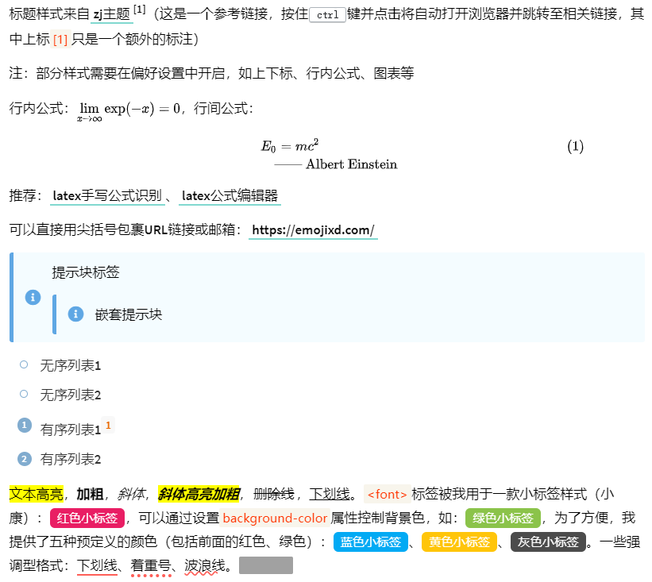

# typora-dyzj-theme

> 最开始下载了[My-Typora-Themes](https://github.com/Theigrams/My-Typora-Themes)主题样式，之后在使用过程中不断修改（主要保留了其经典的标题样式、图片阴影样式、任务列表样式等），得到目前的自用款式，主要新增了有序/无序列表样式、超链接样式、提示块样式以及一些文本样式等

## 使用指南

1. 依次点击Typora菜单栏的“文件”-“偏好设置”，然后点击“外观”-“打开主题文件夹”
2. 下载本主题样式，解压缩至上述“主题文件夹”（其中“dyzj.css”和“source/”文件是必须的，其他可以删除），重启Typora即可

    
修改主题配色或字体（可选操作）

     
    编辑<code>dyzj.css</code>配置文件：
    <pre>
    --select-text-bg-color: #ffafa3; /* 文本选中背景色 */
    --focus-color: #ff5d52; /* 点击某些元素（如标题）显示的颜色 */
    --codeblockbg-color: #eee; /* 代码块背景色 */
    --codeblockfont-color: #555; /* 代码块默认字体颜色 */
    --titlebefore-color: #00c4b6; /* 各级标题图标颜色 */
    --codeblocknum-color: rgba(128, 128, 255, 0.8); /* 代码块行编号颜色 */
    --blockquoteicon-color: #5fa7e4; /* 提示块图标色 */
    --blockquotebg-color: #f4fcff; /* 提示块背景色 */
    --ulol-color: #81accf; /* 有序无序列表图标颜色 */
    --tableevenrow-color: #eee; /* 表格偶数行颜色 */
    --tablefocusrow-color: rgba(100, 221, 221, 0.2); /* 表格选中行颜色 */
    --tableborder-color: #c5c5c5; /* 表格边框色 */
    --tablethbg-color: #f4fcff; /* 表格表头背景色 */
    --toc-color: #00a0a0; /* 目录颜色 */
    --atext-color: black; /* 超链接文本颜色 */
    --abottom-color: #81d8cf; /* 超链接下划线颜色 */
    --code-color: #ff3502; /* 行内代码前景色 */
    --codebg-color: #f8f5ec; /* 行内代码背景色 */
    --footnote-color: #e96900; /* 脚注上标前景色 */
    --footnotebg-color: #f8f8f8; /* 脚注上标背景色 */
    --highlight-color: red; /* 高亮文本前景色 */
    --highlightbg-color: yellow; /* 高亮文本背景色 */
    --split-color: #00c4b6; /* 分割线颜色 */
    --taskborder-color: red; /* 任务列表边框色 */
    --taskfocus-color: #00c4b6; /* 任务列表选中填充色 */
    --spannote-color: #e91e64; /* 默认小标签背景色 */
    --emptext-color: #fe5f58; /* 几款强调型文本的颜色 */
    --hidetextcover-color: #a1a1a1; /* 隐藏文本遮罩颜色 */
    --hidetext-color: #444; /* 隐藏文本颜色 */
    --spanbtn-color: #44d7b6; /* 文本按钮颜色 */
    --detailstxt-color: rgba(68,68,68,.7); /* 折叠框标题文字颜色 */
    --detailsbg-color: #ebf9ed; /* 折叠框背景色 */
    --detailsborder-color: #00c4b6; /* 折叠框边框色 */
    --body-color: #000000; /* 全局文本颜色 */
    --para-color: #000000; /* 段落文本颜色 */
    --body-font: 'Source Sans Pro'; /* 全局字体 */
    --code-font: 'JetBrains Mono'; /* 代码块以及行内代码字体 */
    </pre>

## 样式预览

你可以在下载的“demo.md”中查阅以上内容，或者前往<a href="https://typora-dyzj-theme.vercel.app/">地址</a>在线预览

致谢：[zj主题作者](https://github.com/Theigrams/My-Typora-Themes)、[butterfly主题](https://github.com/jerryc127/hexo-theme-butterfly)